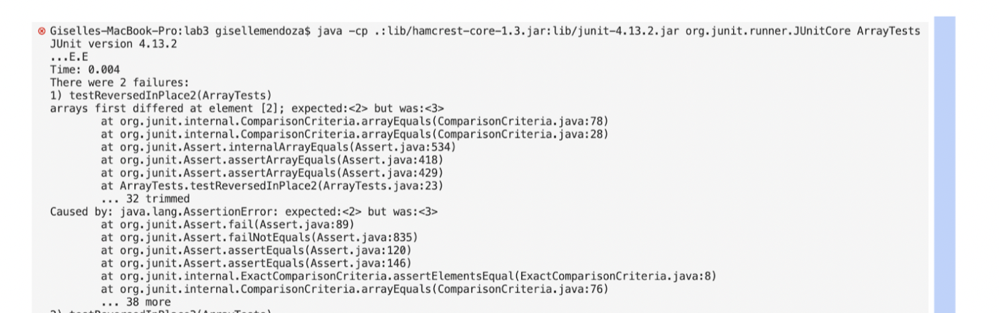

# Welcome to CSE 15L *Lab Report 2*
## Part 1


## Part 2
Bugs from lab 3
Failure inducing input for method `reverseInPlace` 

```
  @Test
  public void testReversedInPlace2(){
    int[] input2= {1,2,3,4};
    ArrayExamples.reverseInPlace(input2);
    assertArrayEquals(new int[]{4,3,2,1}, input2);
  }
```
this test is meant to have an outcome of an int array that follows this format `{4,3,2,1}` yet the bug in the code causes it to print something else. We see this in the following image.




