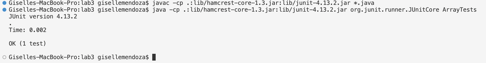

# Welcome to CSE 15L *Lab Report 2*
## Part 1


## Part 2
Bugs from lab 3
Failure inducing input for method `reverseInPlace` 

```
  @Test
  public void testReversedInPlace2(){
    int[] input2= {1,2,3,4};
    ArrayExamples.reverseInPlace(input2);
    assertArrayEquals(new int[]{4,3,2,1}, input2);
  }
```
This test is meant to have an outcome of an int array that follows this format `{4,3,2,1}` yet the bug in the code causes it to print something else. We see this in the following image. This image will show the output than can be considered the **symptom** of the bug.


<sub> This image shows that for index 2, the expected value was 2 but the actual value from the buggy program was 3. This is because the the for loop used in the reverseInPlace method does not divide the length (used as the condition for i) so it essentially switches the elements to the correct reversed order and instead of stopping there it does this once more, setting the array back to its original order. </sub>

Before fixing this issue, we could try more tests. We can try one that would not induce failure. 

```
  @Test
  public void testReversedInPlace3(){
    int[] input2= {1};
    ArrayExamples.reverseInPlace(input2);
    assertArrayEquals(new int[]{1}, input2);
  }
```
Since this test is reversing the order of an array with only one element in it, it does not accuretly show the bug. We see this in the following image.

<sub> Which basically shows that this test ran and there was no issue with the actual and expected output. </sub>

Now the following code is the one with the bug:
```
  static int[] reversed(int[] arr) {
    int[] newArray = new int[arr.length];
    for(int i = 0; i < arr.length; i += 1) {
      arr[i] = newArray[arr.length - i - 1];
    }
    return arr;
  }
```

As mentioned bofore one of the reasons why the code does not work as intended is becaused of the condition for i in the for loop. It also fails to keep track of the item that is moving from the first index to the last. To fix something like this we could alter the code in the following way:

```
  static void reverseInPlace(int[] arr) {
    for(int i = 0; i < arr.length/2; i += 1) {
      int temp=arr[i];
      arr[i] = arr[arr.length - i - 1];
      arr[arr.length -i-1]=temp;

    }
  }
```

