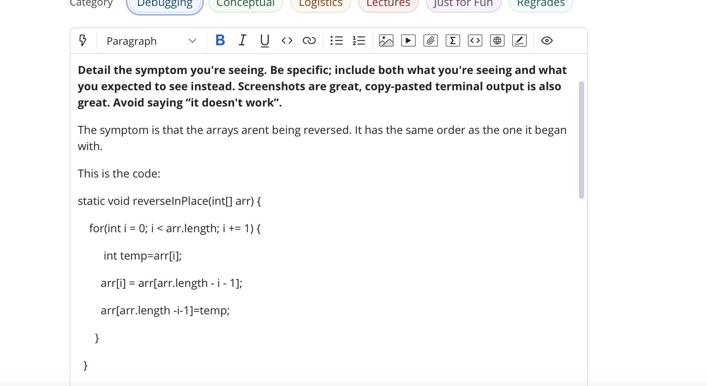
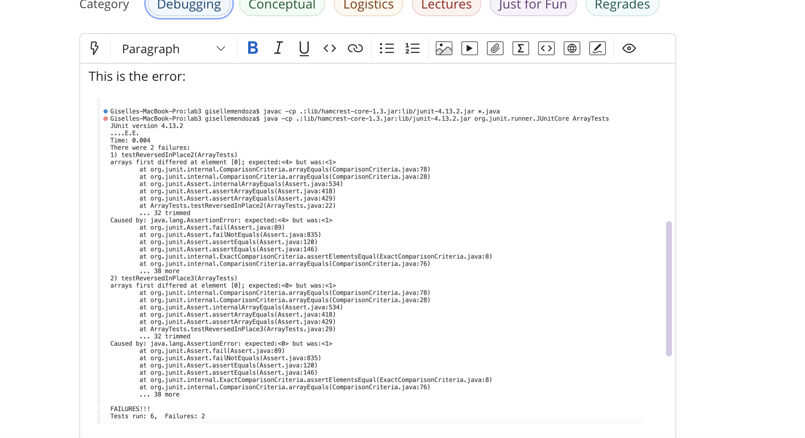

# Welcome to CSE 15L *Lab Report 5*
## Working with the Debugging

### The ticket:
Pt1:

Pt2.1:

Pt2.2:

Pt3:

### TA Feedback:

### Student trying the Feedback:
We see that the student is tracing through the code and comes across the wanted array during the first iteration of the for loop, yet once it continies the for loop we see that it takes it back to the first array. 

 
