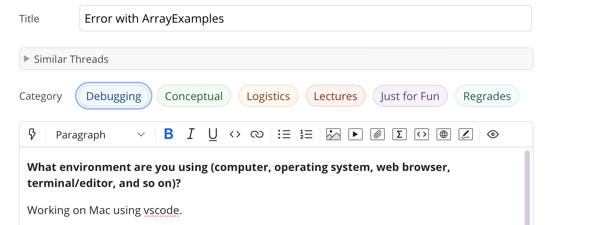
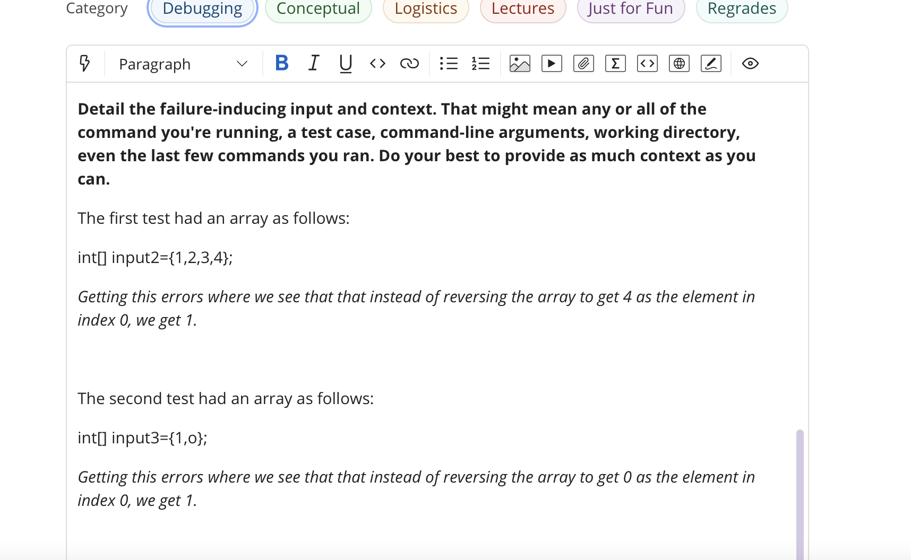
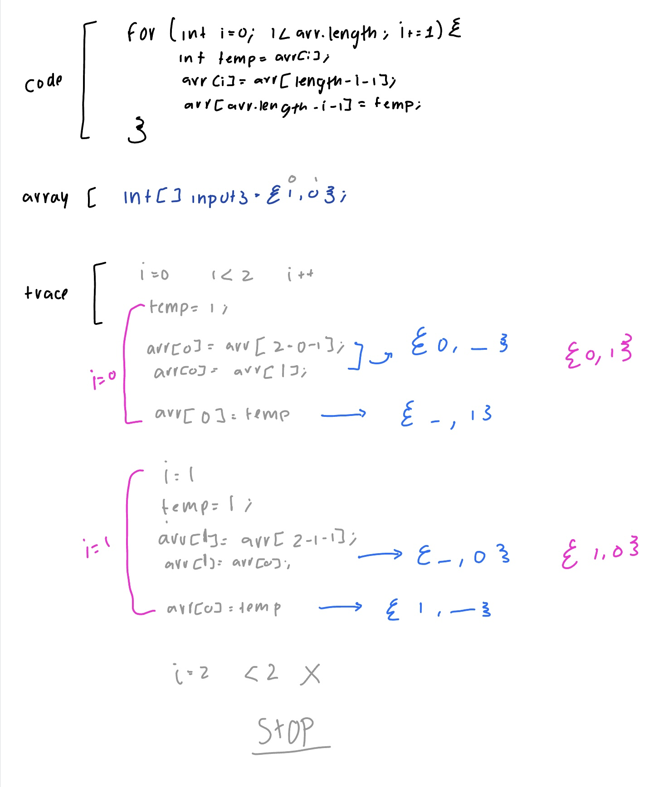

# Welcome to CSE 15L *Lab Report 5*
## Debugging


## Part 1 Student Bug:

### The ticket:
Pt1:



Pt2.1:


Pt2.2:


Pt3:



### TA Feedback:


### Student trying the Feedback:
We see that the student is tracing through the code and comes across the wanted array during the first iteration of the for loop, yet once it continies the for loop we see that it takes it back to the first array. 


We then see the student realize the condition should be 

````i<arr.length/2````

Code fixed:


Tests now:

 
 
 
 
## Part 2: Reflection
Something that i learning during lab in the second half of this quarter that i didnt know before is that usign vim in the command line to edit java files. This was soemthing i had never done since i didnt know what vim is, it was sort of challenging undestanding how to commit those changes after but the actual editing was not that hard for me to undestand. Something cool in general is using github, i had hear of it before but never did anything with it so being able to use it for this class was very cool, learnig how do to simple thigns with it was enjoyable. 
